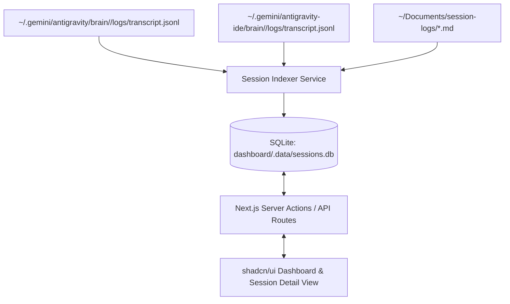

# PRD: Antigravity Session Analytics & Log Review Dashboard

## 1. Overview & Objective

Build a local web application to visualize, analyze, and review Antigravity Conversations and Session Logs. The dashboard scans brain roots (`~/.gemini/antigravity/brain` and `~/.gemini/antigravity-ide/brain`) and the Session Logs root (`~/Documents/session-logs`), indexes user prompts, model IDs, thinking levels, task classifications, tool call frequencies, and Outcomes — then presents them via an interactive shadcn/ui dashboard.

**Data volume**: ~340 CLI conversations, IDE brain conversations, ~150 Session Logs.

---

## 2. Technical Stack & Architecture

- **Framework**: Next.js 15 (App Router, TypeScript, React 19)
- **Styling & UI**: Tailwind CSS v4, `shadcn/ui` components (Card, DataTable, Tabs, Badge, Dialog, Select, Input, Chart)
- **Icons & Visualization**: Lucide React, Recharts (`@shadcn/ui/chart`)
- **Database & ORM**: SQLite (`better-sqlite3` + `drizzle-orm`) stored at `dashboard/.data/sessions.db`
- **Data Parser**: Custom Node.js indexer scanner for `.jsonl` and `.md` files



---

## 3. Data Model & Schema

### Transcript field schema (verified)

Each line of `transcript.jsonl` has these keys:
`step_index`, `source`, `type`, `status`, `created_at`, `content`, `thinking`, `tool_calls`, `truncated_fields`

> **Model and thinking level are NOT standalone fields.** They are embedded in `USER_SETTINGS_CHANGE` XML tags within `content` of `USER_INPUT` steps:
> ```
> <USER_SETTINGS_CHANGE>
> The user changed setting `Model Selection` from None to Gemini 3.6 Flash (High).
> </USER_SETTINGS_CHANGE>
> ```
> The indexer must regex-extract model name and thinking level from these blocks. A single conversation may change models mid-session; store the **initial** and **last** model used.

### `sessions` Table
| Field | Type | Description |
|---|---|---|
| `id` | TEXT (PK) | Conversation id (UUID, domain term from CONTEXT.md) |
| `source_brain` | TEXT | `cli` or `ide` — which brain root this was scanned from |
| `first_prompt` | TEXT | First user prompt / task request (stripped of `<USER_REQUEST>` tags) |
| `model_initial` | TEXT | First model detected via `USER_SETTINGS_CHANGE` (nullable) |
| `model_last` | TEXT | Last model detected (nullable — same as initial if never changed) |
| `thinking_level` | TEXT | Thinking level from model name suffix: `Low`, `Medium`, `High`, or null |
| `task_type` | TEXT | Heuristic classification tag (`feature`, `debug`, `refactor`, `research`, `config`, `setup`) |
| `task_type_override` | TEXT | User manual override tag (null if auto-classified) |
| `total_steps` | INTEGER | Total step count in transcript |
| `user_request_count` | INTEGER | Number of USER_INPUT steps |
| `date_start` | TEXT | ISO date of first step |
| `date_end` | TEXT | ISO date of last step |
| `linked_log_path` | TEXT | Relative path to linked Session Log under `~/Documents/session-logs/` (nullable) |
| `outcome_snippet` | TEXT | Outcome text extracted from linked Session Log (nullable) |
| `indexed_at` | TEXT | Timestamp of last indexing |

### `tool_calls` Table
| Field | Type | Description |
|---|---|---|
| `id` | INTEGER (PK) | Auto-increment ID |
| `session_id` | TEXT (FK) | Reference to `sessions.id` |
| `tool_name` | TEXT | Executed tool name (e.g. `run_command`, `replace_file_content`, `view_file`) |
| `call_count` | INTEGER | Total executions in session |

---

## 4. Feature Requirements

### 4.1 Ingestion & Indexing Engine
- Scan both brain roots (CLI and IDE) for Antigravity Conversations with `transcript.jsonl` or `transcript_full.jsonl`.
- Scan `~/Documents/session-logs/*.md` for Session Logs; cross-link to Conversations using existing matching logic (Conversation ID field → metadata Session ID → brain path UUID).
- Extract model name and thinking level from `USER_SETTINGS_CHANGE` content via regex.
- Count tool calls from `PLANNER_RESPONSE` steps with `tool_calls` arrays.
- Run rule-based heuristic classifier on first prompt keywords + tool call signatures → `task_type`.
- Incremental updates: skip conversations whose transcript file `mtime` hasn't changed since `indexed_at`.

### 4.2 Analytics Dashboard View
- **Summary Cards**: Total Conversations, Active Models distribution, Top Tools Used, Task Type distribution.
- **Charts** (Recharts / shadcn Charts):
  - **Tool Usage Distribution**: Horizontal bar chart of top-N tool invocations across all sessions.
  - **Task Type Breakdown**: Donut chart of task categories.
  - **Model & Thinking Level Usage**: Stacked bar chart.
  - **Sessions Over Time**: Area chart by date.
- **Search & Filterable Sessions Table** (shadcn DataTable):
  - Full-text search across prompts and Conversation ids.
  - Multi-select filter dropdowns: Model, Thinking Level, Task Type, Source Brain.
  - Inline task type badge that opens a dropdown to override classification.
  - Column sorting, pagination.

### 4.3 Session Detail View
- **Header**: Conversation id, First Prompt, Date range, Model badge(s), Thinking Level badge, Task Type selector.
- **Tab 1: Outcome & Session Log**: Rendered Markdown of linked Session Log body (GFM). Shows "unlinked" state if no match.
- **Tab 2: Tool Analytics**: Bar chart + detailed table of tool name → call count for this session.
- **Tab 3: Transcript Timeline**: Collapsible step-by-step timeline showing User prompts, Planner responses (with thinking), and Tool call cards (name + truncated args).

---

## 5. Vertical-Slice Ticket Breakdown

Tickets are tracer-bullet vertical slices — each cuts through schema, indexer, API, and UI so it's demoable on its own.

### Ticket 1: Project Bootstrap & Skeleton Dashboard
- **Blocked by**: None — can start immediately
- **What it delivers**: Running `npm run dev` shows a Next.js app with shadcn/ui theme, empty dashboard page with placeholder cards, and SQLite database initialized with `sessions` + `tool_calls` tables via Drizzle migration.

### Ticket 2: Conversation Indexer — Scan, Parse & Persist
- **Blocked by**: Ticket 1
- **What it delivers**: A CLI command or API route (`/api/index`) that scans both brain roots, parses each `transcript.jsonl` for first prompt, step count, user request count, date range, model/thinking extraction from `USER_SETTINGS_CHANGE`, tool call aggregation — and writes rows to SQLite. Re-running skips unchanged transcripts. Running it populates the DB with real data from ~340+ conversations.

### Ticket 3: Session Log Ingestion & Cross-Linking
- **Blocked by**: Ticket 2
- **What it delivers**: The indexer also scans `~/Documents/session-logs/*.md`, extracts Outcome text, cross-links to Conversations by Conversation id / Session ID / brain path UUID, and stores `linked_log_path` + `outcome_snippet` on matching session rows.

### Ticket 4: Heuristic Task Type Classifier
- **Blocked by**: Ticket 2
- **What it delivers**: During indexing, each conversation gets an auto-assigned `task_type` based on first prompt keywords and tool call signature patterns. Classification rules are configurable JSON. The dashboard table shows a task type badge per row.

### Ticket 5: Sessions DataTable with Filters & Search
- **Blocked by**: Ticket 2
- **What it delivers**: The dashboard page shows a shadcn DataTable listing all indexed conversations with columns: Date, Conversation id (short), First Prompt, Model, Thinking Level, Task Type, Steps, Tools count. Full-text search across prompts. Multi-select filter dropdowns for Model, Thinking Level, Task Type, Source Brain. Sorting and pagination.

### Ticket 6: Analytics Summary Cards & Charts
- **Blocked by**: Ticket 5
- **What it delivers**: Above the DataTable, summary metric cards (Total Sessions, Top Model, Top Tool, Task Distribution) and interactive charts: tool usage bar chart, task type donut, model/thinking stacked bar, sessions-over-time area chart. All computed from SQLite aggregations.

### Ticket 7: Session Detail View with Outcome & Tool Analytics
- **Blocked by**: Ticket 3, Ticket 5
- **What it delivers**: Clicking a row in the DataTable navigates to a session detail page. Header shows metadata badges. Tab 1 renders the linked Session Log Markdown body (or "unlinked" empty state). Tab 2 shows a per-session tool usage bar chart + table.

### Ticket 8: Transcript Timeline Tab
- **Blocked by**: Ticket 7
- **What it delivers**: Tab 3 on the session detail page renders a collapsible step-by-step timeline reading directly from `transcript.jsonl`. Shows User prompts, Planner responses (with thinking preview), and Tool call cards with name + truncated arguments. Steps are lazy-loaded or virtualized for large transcripts.

### Ticket 9: Manual Task Type Override
- **Blocked by**: Ticket 5
- **What it delivers**: The task type badge in the DataTable and session detail header is an inline dropdown. Selecting a new value writes `task_type_override` to SQLite via Server Action. Override persists across re-indexing. A "reset" option clears the override back to heuristic default.
